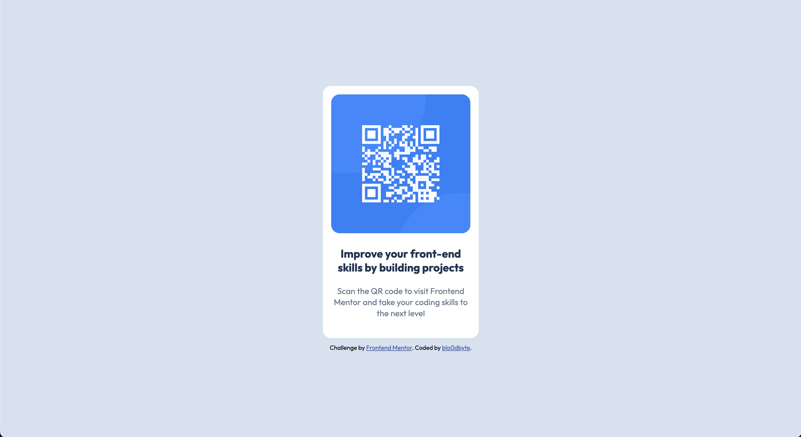

# Frontend Mentor - QR code component solution

This is a solution to the [QR code component challenge on Frontend Mentor](https://www.frontendmentor.io/challenges/qr-code-component-iux_sIO_H). Frontend Mentor challenges help you improve your coding skills by building realistic projects. 

## Table of contents

- [Overview](#overview)
  - [Screenshot](#screenshot)
  - [Links](#links)
  - [Built with](#built-with)
  - [What I learned](#what-i-learned)
  - [Continued development](#continued-development)

# Overview
This challenge was relatively easy. I'm still very new to using Git and Github. I find that the Github interface can be somewhat intimidating and confusing, but I'm glad to have the practice. 

# Screenshot

# Links

- Solution URL: [https://github.com/blo0dbyte/qr-code-component.git]
- Live Site URL: [https://blo0dbyte.github.io/qr-code-component/]

# Built with

- Semantic HTML5 markup
- CSS custom properties
- Flexbox

# What I learned

When it comes to CSS, I struggle most with positioning elements. This challenge was a quick and simple way to practice the skill. As I am still very new to Github and the general concept of repositories, I also gained a very general understanding of how these work. 

# Continued development

Moving forward, I will be refining my CSS skills until I no longer have to think at great length about how to solve an issue in my code. I will also be familiarising myself with Github as I continue to take on more challenges. 